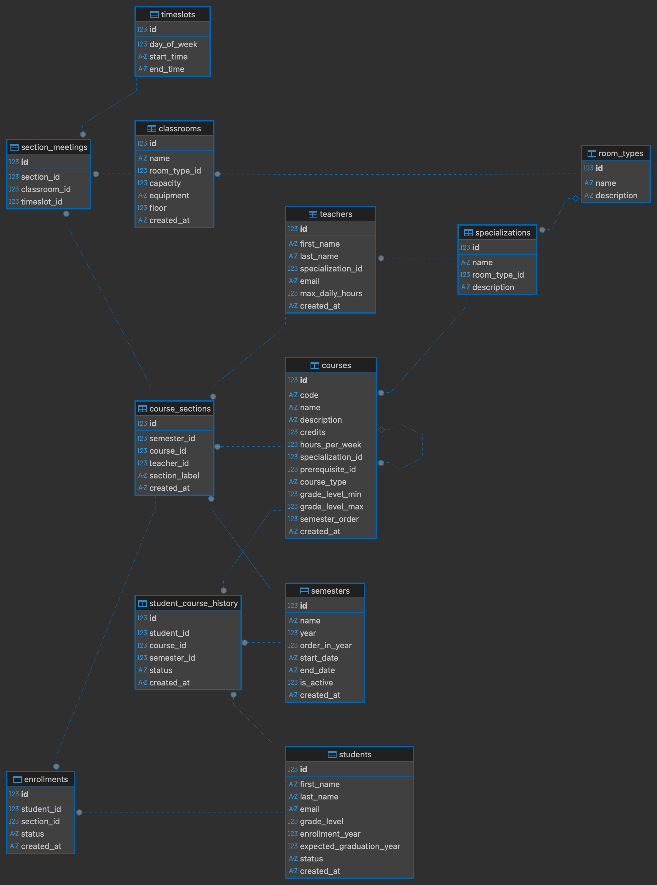

# Blue Dog — Maplewood High School Course Planning System

A full-stack course planning application for Maplewood High School. Students can log in, browse the course catalog, build their semester schedule with a live calendar preview, and commit enrollments — all with real-time validation of prerequisites, time conflicts, capacity limits, and grade-level requirements.



---

## Table of Contents

- [Blue Dog — Maplewood High School Course Planning System](#blue-dog--maplewood-high-school-course-planning-system)
  - [Table of Contents](#table-of-contents)
  - [Tech Stack](#tech-stack)
  - [Getting Started](#getting-started)
    - [Prerequisites](#prerequisites)
    - [Running Locally](#running-locally)
  - [Running with Docker](#running-with-docker)
    - [Docker Compose (development with hot-reload)](#docker-compose-development-with-hot-reload)
    - [Single Production Build](#single-production-build)
  - [Project Structure](#project-structure)
  - [Architecture \& Design Decisions](#architecture--design-decisions)
    - [Backend](#backend)
    - [Frontend](#frontend)
    - [Design Tokens](#design-tokens)
  - [API Reference](#api-reference)
  - [Enrollment Business Rules](#enrollment-business-rules)
  - [Testing](#testing)
    - [Backend Tests](#backend-tests)
    - [Frontend Unit Tests](#frontend-unit-tests)
    - [End-to-End Tests](#end-to-end-tests)
  - [Database](#database)
  - [Potential Future Improvements](#potential-future-improvements)

---

## Tech Stack

| Layer | Technology |
|-------|-----------|
| **Frontend** | React 19, TypeScript 6, Vite 8, Tailwind CSS v4, Zustand 5 |
| **Backend** | Spring Boot 3, Java 21, Spring Data JPA, Hibernate |
| **Database** | SQLite (pre-seeded with 400 students, 57 courses, ~6,700 history records) |
| **Testing** | JUnit 5 + Mockito (backend), Vitest + Testing Library (frontend), Playwright (E2E) |
| **DevOps** | Docker multi-stage build, Docker Compose |

---

## Getting Started

### Prerequisites

- **Java 21** (or higher)
- **Maven 3.9+**
- **Node.js 20+** and npm

### Running Locally

**1. Backend** (port 8080)

```bash
cd backend
mvn spring-boot:run
```

**2. Frontend** (port 5173)

```bash
cd frontend
npm install
npm run dev
```

The frontend proxies `/api` requests to `http://localhost:8080` via the Vite dev server.

Open [http://localhost:5173](http://localhost:5173) in your browser. Log in with any student ID (1–400).

---

## Running with Docker

### Docker Compose (development with hot-reload)

```bash
docker compose -f docker-compose.dev.yml up
```

This starts both services with volume mounts for live code changes.

### Single Production Build

```bash
docker build -t blue-dog .
docker run -p 8080:8080 -p 5173:5173 blue-dog
```

---

## Project Structure

```
blue_dog/
├── backend/                   Spring Boot 3 API
│   └── src/main/java/com/maplewood/
│       ├── controller/        REST endpoints (thin — delegate to services)
│       ├── service/           Business logic, validation, enums, DTO mappers
│       ├── repository/        Spring Data JPA interfaces
│       ├── model/             JPA entities
│       └── dto/               Request/response shapes
├── frontend/                  React 19 + TypeScript SPA
│   └── src/
│       ├── api/               Typed Axios client wrappers
│       ├── components/        Reusable UI components (CalendarGrid, CourseCard, etc.)
│       │   └── ui/            Primitive design-system (Badge, Button, Card)
│       ├── lib/               Utilities (date formatting, color maps, graduation calc)
│       ├── pages/             Route-level page components
│       ├── store/             Zustand state management
│       ├── test/              Test setup
│       └── types/             Shared TypeScript interfaces
├── challenge/                 Original problem statement & reference docs
├── maplewood_school.sqlite    Pre-seeded SQLite database
├── Dockerfile                 Multi-stage production build
└── docker-compose.dev.yml     Dev environment with hot-reload
```

---

## Architecture & Design Decisions

### Backend

- **SOLID Principles**: Services follow Single Responsibility — `EnrollmentService` handles enrollment validation, `CourseService` handles catalog queries, and `CourseSectionDTOMapper` is a dedicated component for entity-to-DTO mapping (extracted to break a circular dependency).
- **Type-Safe Enums**: Status literals (`enrolled`, `dropped`, `passed`, `active`) are centralized in enums (`EnrollmentStatus`, `StudentStatus`, `CourseHistoryStatus`) to eliminate magic strings.
- **Global Exception Handling**: A `@RestControllerAdvice` (`GlobalExceptionHandler`) catches exceptions and returns structured JSON error responses with consistent error codes.
- **DTOs Over Entities**: API responses never expose JPA entities directly — all data flows through DTOs.

### Frontend

- **Centralized State Management (Zustand)**: Two stores cleanly separate concerns:
  - `useStudentStore` — student profile, authentication, academic metrics
  - `useCourseStore` — catalog, sections cache, schedule, pending enrollments, conflict detection
- **Optimistic Staging UX**: Students stage enrollments client-side (shown as dashed calendar blocks). Conflicts are detected immediately. On save, the backend validates each enrollment; failures stay staged with descriptive toast messages.
- **Reusable Components**: Extracted `CourseFilters`, `Badge`, `Button`, `Card`, and other primitives for composability. Color tokens are defined once in Tailwind's `@theme` directive for easy theming.
- **Utility Extraction (DRY)**: Shared logic like `calculateGraduationPct` and `formatMeetingTimes` is extracted into tested utility modules, eliminating duplication across components and stores.

### Design Tokens

The entire color scheme is configurable through semantic Tailwind CSS v4 theme tokens defined in `src/index.css`:

| Token | Purpose |
|-------|---------|
| `primary-*` | Brand / interactive elements |
| `success-*` | Confirmed / enrolled states |
| `danger-*` | Errors / conflicts |
| `warning-*` | Cautions / prerequisites |
| `pending-*` | Staged (uncommitted) enrollments |

---

## API Reference

| Method | Endpoint | Description |
|--------|----------|-------------|
| `GET` | `/api/students/{id}` | Student profile (GPA, credits, course history) |
| `GET` | `/api/students/{id}/schedule` | Current semester enrolled sections |
| `GET` | `/api/courses?gradeLevel=&semester=` | Course catalog with filters |
| `GET` | `/api/courses/{id}/sections` | Sections for a specific course |
| `GET` | `/api/sections?semesterId=` | All sections in a semester |
| `GET` | `/api/semesters/active` | Active semester metadata |
| `POST` | `/api/enrollments` | Enroll — body: `{ studentId, sectionId }` |
| `DELETE` | `/api/enrollments/{id}` | Drop an enrollment |

All enrollment responses return `{ success: boolean, errors: [{ code, message }] }`.

---

## Enrollment Business Rules

The backend enforces all rules server-side in `EnrollmentService`:

1. **Student exists** and is active
2. **Section belongs** to the active semester
3. **Grade level**: student's grade >= course minimum
4. **Max 5 courses** per semester
5. **Prerequisites passed** (checked against `student_course_history`)
6. **No time conflicts** with existing enrollments
7. **Section not full** (capacity check)
8. **Not already enrolled** in the same course

Error codes: `STUDENT_NOT_FOUND` · `SECTION_NOT_FOUND` · `GRADE_MISMATCH` · `MAX_COURSES_EXCEEDED` · `PREREQ_NOT_MET` · `TIME_CONFLICT` · `SECTION_FULL` · `ALREADY_ENROLLED`

---

## Testing

### Backend Tests

```bash
cd backend
mvn test
```

**40 tests** across 6 test classes covering:
- Enrollment validation (all 8 business rules)
- Student profile and GPA calculation
- Course catalog queries and section mapping
- Global exception handler responses

### Frontend Unit Tests

```bash
cd frontend
npm test
```

**20 tests** across 3 test suites covering:
- Graduation percentage calculation (edge cases, rounding)
- Meeting time formatting
- Zustand store logic (pending enrollments, conflict detection, idempotency)

### End-to-End Tests

```bash
cd frontend
npx playwright test
```

Playwright E2E tests cover the full enrollment flow through the browser.

---

## Database

The SQLite database (`maplewood_school.sqlite`) is pre-seeded and committed to the repository. Key statistics:

| Table | Records | Purpose |
|-------|---------|---------|
| `students` | 400 | 100 per grade level (9–12) |
| `courses` | 57 | 20 core + 37 electives with prerequisite chains |
| `student_course_history` | ~6,700 | Historical pass/fail for prerequisite validation |
| `course_sections` | — | Sections created for current semester |
| `section_meetings` | — | Maps sections to timeslots and classrooms |
| `enrollments` | — | Tracks enrolled/dropped status |

Full schema documentation: [challenge/DATABASE.md](challenge/DATABASE.md)

---

## Potential Future Improvements

### 1. Authentication & Authorization (JWT + HttpOnly Cookies)

The application currently uses a simple student ID lookup with no authentication layer. In production this would need:

- **JWT-based authentication** with tokens stored in **HttpOnly, Secure, SameSite=Strict cookies** (not localStorage — immune to XSS).
- A `/api/auth/login` endpoint that validates credentials (hashed with bcrypt), issues a short-lived access token (15 min) and a longer-lived refresh token (7 days) in separate cookies.
- A Spring Security `OncePerRequestFilter` that extracts the JWT from the cookie, validates signature and expiry, and populates the `SecurityContext`.
- **Role-based access control** — `STUDENT` vs `ADMIN` roles, with `@PreAuthorize` annotations on controller methods so students can only access their own data.
- CSRF protection via a synchronizer token pattern (necessary since cookies are sent automatically).

### 2. Course Search at Scale (Database Indexing → Elasticsearch)

With 57 courses the current unindexed queries are fine, but at university scale (thousands of courses):

- **Short term**: Add composite indexes on `courses(grade_level_min, semester_order)` and `course_sections(semester_id, course_id)` to cover the most common query patterns. Add a full-text index on `courses(name, description)` for keyword search.
- **Long term**: Introduce **Elasticsearch** as a read-optimized search layer. The backend would dual-write to both SQLite/Postgres and an ES index (or use Change Data Capture). The frontend would hit an `/api/courses/search` endpoint backed by ES for faceted search (by subject, grade, credits, availability).
- On the frontend, replace the current eager-loaded course list with **infinite scroll using the Intersection Observer API** — a sentinel element at the bottom of the list triggers the next page fetch, keeping the DOM lightweight and initial load fast.

### 3. Caching Layer (Redis)

The application currently makes a fresh database round-trip for every request. High-value caching targets:

- **Course catalog & sections**: Change infrequently during a semester — cache with a TTL of 5–10 minutes. Invalidate on enrollment (capacity changes) via a pub/sub event or cache-aside pattern.
- **Student profile & schedule**: Cache per-student with short TTL (1–2 min), invalidated on enrollment/drop.
- **Active semester metadata**: Nearly static — cache aggressively with long TTL.
- Implementation: Spring Boot's `@Cacheable` / `@CacheEvict` annotations backed by a **Redis** instance. Use `spring-boot-starter-data-redis` with connection pooling (Lettuce).

### 4. Enrollment Queue (RabbitMQ / Message Broker)

When registration opens, hundreds of students hit the enrollment endpoint simultaneously. The current synchronous flow would create database contention and race conditions on section capacity:

- Replace the synchronous `POST /api/enrollments` with a **message queue** (RabbitMQ or SQS). The endpoint would publish an `EnrollmentRequest` message and return `202 Accepted` with a ticket ID.
- A pool of **consumer workers** would process requests sequentially per section (partitioned by `sectionId`), ensuring atomic capacity checks without optimistic locking retries.
- The frontend would poll or use **WebSockets/SSE** to receive the enrollment result asynchronously, showing a "Processing..." state in the UI.
- This also enables **rate limiting** and **fairness guarantees** (FIFO ordering) during peak registration windows.

### 5. High-Level Design Diagram


